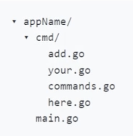
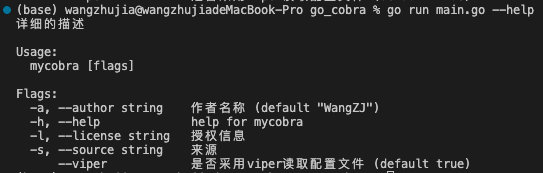
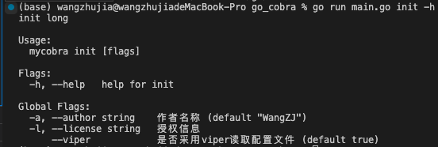
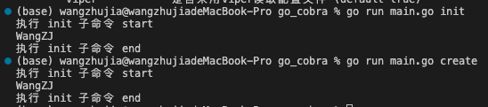
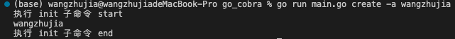

# 命令行项目框架cobra

**当前流行的Docker、K8s、ETCD等都使用了该命令行项目框架**

官网推荐的项目结构如下：



标志类型：

* 持久标志`PersistentFlags()`：当前命令 子命令 子命令下的命令都可以用
* 全局标志：由持久标志衍生，是定义在root命令下的持久标志，所有命令都能用
* 本地标志`Flags()`：只有当前命令可用

### 根命令（这的use不起作用，在根命令下定义三个持久标志和一个本地标志）

```go
var rootCmd = &cobra.Command{
	Use:   "mycobra", //根目录其实用不上 随便叫啥都行
	Short: "简短的描述",
	Long:  "详细的描述",
}

func Execute() {
	rootCmd.Execute()
}

var userLicense string
func init() {
	rootCmd.PersistentFlags().Bool("viper", true, "是否采用viper读取配置文件")
	rootCmd.PersistentFlags().StringP("author", "a", "WangZJ", "作者名称")
	rootCmd.PersistentFlags().StringVarP(&userLicense, "license", "l", "", "授权信息")
	rootCmd.Flags().StringP("source", "s", "", "来源")
}
```



### init命令

这里的use可以使用，如下图所示，可以看到该command可以执行的标志（即root下的全局标志）

```go
var initCmd = &cobra.Command{
	Use:     "init",
	Short:   "init short",
	Long:    "init long",
	Aliases: []string{"create"},  // 别名
	Run: func(cmd *cobra.Command, args []string) {
		fmt.Println("执行 init 子命令 start")
		author := cmd.Flags().Lookup("author").Value
		fmt.Println(author)
		fmt.Println("执行 init 子命令 end")
	},
}
func init() {
	rootCmd.AddCommand(initCmd)
}
```







### 参数验证、内置参数验证器

```go
// 自定义验证
var curArgsCheckCmd = &cobra.Command{
	Use:   "cus",
	Long:  "",
	Short: "",
	Args: func(cmd *cobra.Command, args []string) error {
		if len(args) < 1 {
			return errors.New("至少输入一个参数")
		}
		if len(args) > 2 {
			return errors.New("至多输入两个个参数")
		}
		return nil
	},
	Run: func(cmd *cobra.Command, args []string) {
		fmt.Println("自定义参数验证 start")
		fmt.Println(args)
		fmt.Println("自定义参数验证 end")
	},
}

// 无参数验证
var noArgsCmd = &cobra.Command{
	Use:  "noargs",
	Args: cobra.NoArgs,
	RunE: func(cmd *cobra.Command, args []string) error {
		fmt.Println("无参数验证 start")
		fmt.Println(args)
		fmt.Println("无参数验证 end")
		return nil
	},
}

// 可以接受任何参数的验证
var arbitrayArgCmd = &cobra.Command{
	Use:  "ab",
	Args: cobra.ArbitraryArgs,
	RunE: func(cmd *cobra.Command, args []string) error {
		fmt.Println("可接受任何参数 start")
		fmt.Println(args)
		fmt.Println("可接受任何参数 end")
		return nil
	},
}

// 限定参数验证
var onlyArgsCmd = &cobra.Command{
	Use:       "only",
	Args:      cobra.OnlyValidArgs,
	ValidArgs: []string{"123", "456"},
	RunE: func(cmd *cobra.Command, args []string) error {
		fmt.Println("only start")
		fmt.Println(args)
		fmt.Println("only end")
		return nil
	},
}

// 恰有两个参数的验证
var exactArgsCmd = &cobra.Command{
	Use:  "exact",
	Args: cobra.ExactArgs(2),
	RunE: func(cmd *cobra.Command, args []string) error {
		fmt.Println("exact start")
		fmt.Println(args)
		fmt.Println("exact end")
		return nil
	},
}

func init() {
	rootCmd.AddCommand(curArgsCheckCmd)
	rootCmd.AddCommand(noArgsCmd)
	rootCmd.AddCommand(arbitrayArgCmd)
	rootCmd.AddCommand(onlyArgsCmd)
	rootCmd.AddCommand(exactArgsCmd)
}
```

### 钩子函数定义与使用

钩子函数可以在命令的前后加些内容

钩子函数执行顺序以及继承等如下所示：

```go
var hookRootCmd = &cobra.Command{
	Use: "hookroot",
	Run: func(cmd *cobra.Command, args []string) {
		// 第三个被执行
		fmt.Println("钩子函数 run")

	},
	PersistentPreRun: func(cmd *cobra.Command, args []string) {
		// run函数之前执行  可被继承  第一个被执行
		fmt.Println("PersistentPreRun")
	},
	PersistentPostRun: func(cmd *cobra.Command, args []string) {
		// run函数之后执行  可被继承   第五个被执行
		fmt.Println("PersistentPostRun")
	},
	PreRun: func(cmd *cobra.Command, args []string) {
		// run函数之前执行  不可被继承  第二个被执行
		fmt.Println("PreRun")
	},
	PostRun: func(cmd *cobra.Command, args []string) {
		// run函数之后执行  不可被继承  第四个被执行
		fmt.Println("PostRun")
	},
}

var hookSubCmd = &cobra.Command{
	Use: "hooksub",
	Run: func(cmd *cobra.Command, args []string) {
		// 第三个被执行
		fmt.Println("钩子函数 run")

	},

	PersistentPostRun: func(cmd *cobra.Command, args []string) {
		// run函数之后执行  可被继承   第五个被执行
		fmt.Println("PersistentPostRun")
	},
	PreRun: func(cmd *cobra.Command, args []string) {
		// run函数之前执行  不可被继承  第二个被执行
		fmt.Println("PreRun")
	},
}

func init() {
	rootCmd.AddCommand(hookRootCmd)
	hookRootCmd.AddCommand(hookSubCmd)
}
```

